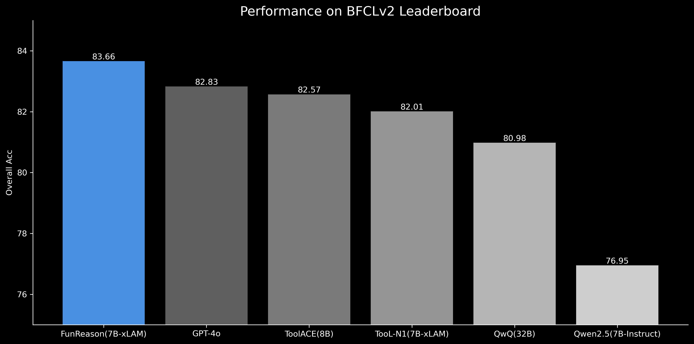
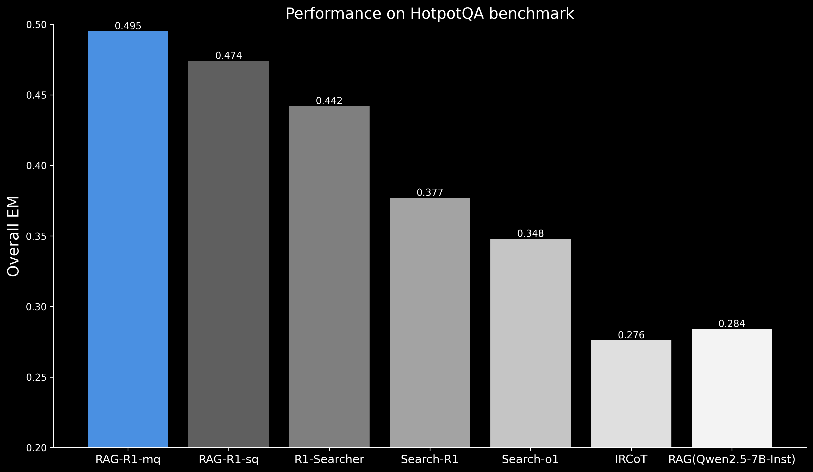
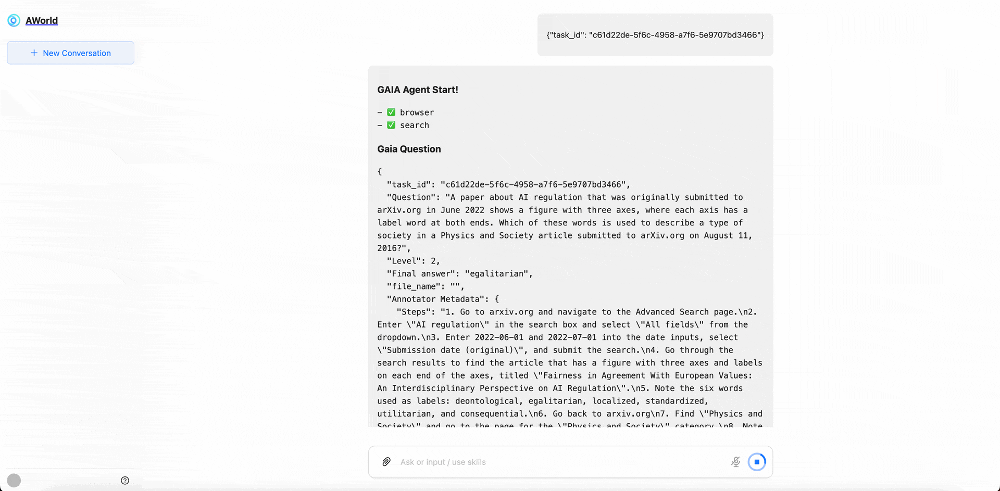

<div align="left">

# AWorld: The Agent Runtime for Self-Improvement
*"Self-awareness: the hardest problem isn't solving within limits, it's discovering the own limitations"*


[](https://x.com/InclusionAI666)
[](https://raw.githubusercontent.com/inclusionAI/AWorld/main/readme_assets/aworld_wechat.png)
[](https://discord.gg/b4Asj2ynMw)
[](https://opensource.org/licenses/MIT)
[](https://deepwiki.com/inclusionAI/AWorld)
<!-- [](https://arxiv.org/abs/xxxx.xxxxx) -->

</div>

[中文版](./README_zh.md)

## Table of Contents
- [News](#news) — Latest updates and announcements.
- [Introduction](#introduction) — Overview and purpose of the project.
- [Installation](#installation) — Step-by-step setup instructions.
- [Quick Start](#quick-start) — Get started with usage examples.
- [Architecture](#architecture) — Explore the multi-agent system design.
- [Demo](#demo) — See the project in action with demonstrations.
- [Contributing](#contributing) — How to get involved and contribute.
- [License](#license) — Project licensing details.

## News
- 🦤 [2025/07/07] AWorld, as a runtime, is now ready for agentic training. See [Self-Improvement section](#self-improvement-with-diverse-runtimes) for details. We have updated our score to 77.08 on the GAIA test. Learn how to construct a GAIA runtime in the [Demo section](#demo-of-gaia-agent-runtime).
- 🦩 [2025/06/19] We have updated our score to 72.43 on the GAIA test. Additionally, we have introduced a new local running mode. See `./README-local.md` for detailed instructions.
- 🐳 [2025/05/22] For quick GAIA evaluation, MCP tools, AWorld, and models are now available in a single Docker image. See <code>./README-docker.md</code> for instructions and [youtube video](https://www.youtube.com/watch?v=kkYWeVvJKrg) for demo.
- 🥳 [2025/05/13] AWorld has updated its state management for browser use and enhanced the video processing MCP server, achieving a score of 77.58 on GAIA validation (Pass@1 = 61.8) and maintaining its position as the top-ranked open-source framework. Learn more: [GAIA leaderboard](https://huggingface.co/spaces/gaia-benchmark/leaderboard)
- ✨ [2025/04/23] AWorld ranks 3rd on GAIA benchmark (69.7 avg) with impressive Pass@1 = 58.8, 1st among open-source frameworks. Reproduce with <code>python examples/gaia/run.py</code>


## Introduction
AWorld (Agent World) is a multi-agent playground that enables agents to collaborate and self-improve. The framework supports a wide range of applications, including but not limited to product prototype verification, foundation model training and Multi-Agent System (MAS) design meta-learning.

### Runtime Key Features
| 1. Agent Construction | 2. Topology Orchestration | 3. Environments |
|----------------------|--------------------------|-----------------|
| • ✅ Support for various model services <br> • ✅ Integration with MCP tools <br> • ✅ Custom tool support | • ✅ Protocol encapsulation between models and tools <br> • ✅ Protocol encapsulation among agents | • ✅ Runtime state management <br> • ✅ State tracing support <br> • ✅ Distributed, high-concurrency environments for training |

### Self-Improvement with Diverse Runtimes
By constructing diverse runtime environments (with tools, agents, or models in them), AWorld aims to find the limitations of a model and push intelligence forward. Here we will record some of our work to prove the effectiveness of our proposal.

| Category | Runtime | Performance | Key Information |
|-----|----------------|-------------|--------------|
| Tool Use | Function call runtime to be released | Competitive on BFCL benchmark  <br>  | []() <br> [](https://huggingface.co/Bingguang/FunReason) <br> [](https://arxiv.org/pdf/2505.20192) <br> []() <br> [](https://github.com/BingguangHao/FunReason)|
| Deep Search | Search runtime to be released | SOTA on HotpotQA benchmark  <br>  | [](https://github.com/inclusionAI/AgenticLearning) <br> [](https://huggingface.co/collections/endertzw/rag-r1-68481d7694b3fca8b809aa29) <br> [](https://arxiv.org/abs/2507.02962) <br> [](https://github.com/inclusionAI/AgenticLearning)|

### Demo of GAIA Agent-Runtime


Here we first introduce the **GAIA runtime**, which can be constructed on your local computer. It can be used for:

- **Product prototype verification**
- **Self-improvement training** (See [training pipeline](#backward) for details)

Follow the instructions in [`./examples/gaia/README.md`](./examples/gaia/README.md) to initialize the GAIA agent runtime and run the demo shown above.

> **Want to build your own multi-agent system? Check out the detailed tutorials below to get started! ⬇️⬇️⬇️** 

## Installation
 Python>=3.11:
```bash
git clone https://github.com/inclusionAI/AWorld
cd AWorld
python setup.py install
```

## Quick Start
> Get started with AWorld in minutes! Follow this step-by-step guide to create and deploy your first intelligent agent.

### Prerequisites
- Python 3.11 or higher
- An OpenAI Compatible LLM API provider credentials

### 1. Environment Setup

**Option A: Using Virtual Environment (Recommended)**
```shell
# Create and activate virtual environment
python -m venv .venv
source .venv/bin/activate  # On Windows: .venv\Scripts\activate

# Install AWorld
pip install aworld -U
```

**Option B: Using Conda**
```shell
# Create and activate conda environment
conda create -n aworld python=3.12 -y
conda activate aworld

# Install AWorld
pip install aworld -U
```

### 2. Choose Your Development Approach

AWorld offers two flexible approaches to build and run your agents:

#### 🌐 Option A: Web-Based Agent (Recommended for beginners)
Perfect for rapid prototyping with built-in UI and REST API

#### 💻 Option B: Script-Based Agent  
Ideal for custom integrations and advanced use cases

---

### 🌐 Option A: Web-Based Agent Development

#### Step 1: Create Project Structure
```shell
mkdir my-aworld-project && cd my-aworld-project
mkdir -p agent_deploy/my_first_agent
```

Your project structure should look like this:
```text
agent-project-root-dir/
    agent_deploy/
      my_first_agent/
        __init__.py
        agent.py
```

#### Step 2: Initialize Agent Module
Create the required `__init__.py` file:
```shell
cd agent_deploy/my_first_agent
touch __init__.py
```

#### Step 3: Define Your Agent
Create `agent.py` with your agent logic:

```python
import logging
import os
from aworld.cmd.data_model import BaseAWorldAgent, ChatCompletionRequest
from aworld.config.conf import AgentConfig, TaskConfig
from aworld.agents.llm_agent import Agent
from aworld.core.task import Task
from aworld.runner import Runners

logger = logging.getLogger(__name__)

class AWorldAgent(BaseAWorldAgent):
    def __init__(self, *args, **kwargs):
        super().__init__(*args, **kwargs)

    def name(self):
        return "My First Agent"

    def description(self):
        return "A helpful assistant that can answer questions and help with tasks"

    async def run(self, prompt: str = None, request: ChatCompletionRequest = None):
        # Load LLM configuration from environment variables
        agent_config = AgentConfig(
            llm_provider=os.getenv("LLM_PROVIDER", "openai"),
            llm_model_name=os.getenv("LLM_MODEL_NAME", "gpt-4"),
            llm_api_key=os.getenv("LLM_API_KEY"),
            llm_base_url=os.getenv("LLM_BASE_URL"),
            llm_temperature=float(os.getenv("LLM_TEMPERATURE", "0.7"))
        )

        # Validate required configuration
        if not agent_config.llm_model_name or not agent_config.llm_api_key:
            raise ValueError("LLM_MODEL_NAME and LLM_API_KEY must be set!")

        # Optional: Configure MCP tools for enhanced capabilities
        mcp_config = {
            "mcpServers": {
                "amap-mcp": {
                    "type": "sse",
                    "url": "https://mcp.example.com/sse?key=YOUR_API_KEY",
                    "timeout": 30,
                    "sse_read_timeout": 300
                }
            }
        }

        # Create the agent instance
        agent = Agent(
            conf=agent_config,
            name="My First Agent",
            system_prompt="""You are a helpful AI assistant. Your goal is to:
            - Answer questions accurately and helpfully
            - Provide clear, step-by-step guidance when needed
            - Be friendly and professional in your responses""",
            mcp_servers=["amap-mcp"],
            mcp_config=mcp_config
        )

        # Extract user input
        user_input = prompt or (request.messages[-1].content if request else "")
        
        # Create and execute task
        task = Task(
            input=user_input,
            agent=agent,
            conf=TaskConfig(max_steps=5),
            session_id=getattr(request, 'session_id', None)
        )

        # Stream the agent's response
        async for output in Runners.streamed_run_task(task).stream_events():
            yield output
```

#### Step 4: Set Environment Variables
```shell
# Navigate back to project root
cd ${agent-project-root-dir}

# Set your LLM credentials
export LLM_MODEL_NAME="gpt-4"
export LLM_API_KEY="your-api-key-here"
export LLM_BASE_URL="https://api.openai.com/v1"  # Optional for OpenAI
```

#### Step 5: Launch Your Agent
```shell
# Option 1: Launch with Web UI (Interactive chat interface)
aworld web
# Then open http://localhost:8000 in your browser

# Option 2: Launch REST API (For integrations)
aworld api_server
# Then visit http://localhost:8000/docs for API documentation
```

🎉 **Success!** Your agent is now running and ready to chat!

---

### 💻 Option B: Script-Based Agent Development

Perfect for custom workflows and programmatic usage.

#### Step 1: Create Agent Script
Create `my_agent.py`:

```python
import os
from aworld.config.conf import AgentConfig
from aworld.agents.llm_agent import Agent
from aworld.runner import Runners
from aworld.core.agent.swarm import Swarm

def create_agent_team(user_query: str):
    """Create and run a multi-agent team to handle user queries."""
    
    # Configure your LLM settings
    agent_config = AgentConfig(
        llm_provider=os.getenv("LLM_PROVIDER", "openai"),
        llm_model_name=os.getenv("LLM_MODEL_NAME", "gpt-4"),
        llm_api_key=os.getenv("LLM_API_KEY"),
        llm_base_url=os.getenv("LLM_BASE_URL"),
        llm_temperature=float(os.getenv("LLM_TEMPERATURE", "0.7"))
    )

    # Optional: Advanced MCP tool integration
    mcp_config = {
        "mcpServers": {
            "amap-mcp": {
                "type": "sse", 
                "url": "https://mcp.example.com/search?key=YOUR_API_KEY",
                "timeout": 30,
                "sse_read_timeout": 300
            }
        }
    }

    # Create specialized agents
    researcher = Agent(
        conf=agent_config,
        name="Research Agent",
        system_prompt="You are an expert researcher. Find accurate, up-to-date information.",
        mcp_servers=["amap-mcp"],
        mcp_config=mcp_config
    )

    analyst = Agent(
        conf=agent_config,
        name="Analysis Agent", 
        system_prompt="You are an expert analyst. Synthesize information and provide insights."
    )

    # Create agent team with collaborative workflow
    agent_team = Swarm(researcher, analyst)

    # Execute the task
    result = Runners.sync_run(
        input=user_query,
        swarm=agent_team
    )
    
    return result

if __name__ == '__main__':
    # Example usage
    query = "What are the latest developments in AI agent technology?"
    response = create_agent_team(query)
    
    print("🤖 Agent Team Response:")
    print("=" * 50)
    print(response.model_dump_json(indent=2))
```

#### Step 2: Set Environment and Run
```shell
# Set your LLM credentials
export LLM_MODEL_NAME="gpt-4"
export LLM_API_KEY="your-api-key-here"
export LLM_BASE_URL="https://api.openai.com/v1"

# Run your agent
python my_agent.py
```

---

### Next Steps

- **Customize**: Modify prompts and workflows for your specific needs
- **Add Tools**: Integrate MCP servers for enhanced capabilities  
- **Explore Examples**: Check out `./examples/cmd` for advanced use cases


## Architecture
AWorld is designed to achieve two primary objectives: (1) provide an efficient forward process, and (2) facilitate diverse backward processes, including but not limited to foundation model training and system design meta-learning.

### Forward
> An illustration of the runtime, showing the message workflow when Agent1 receives a query from a user.


### Backward

> During training, an action-state rollout demonstration using **AWorld's distributed environments**.


> An illustration of training code that seamlessly integrates the RL learning framework (Swift, in this example) with AWorld as the environment is shown below. This integration enables scalable and efficient agent training through distributed environment execution. (To run high-concurrency rollouts, you need to deploy an online distributed environment. Please contact [chenyi.zcy@antgroup.com](mailto:chenyi.zcy@antgroup.com) if assistance is needed.)

#### Usage

To apply and use this integration:

1. Clone AWorld's `agent_training_server` branch:
```bash
git clone -b agent_training_server --single-branch https://github.com/inclusionAI/AWorld.git AWorld
```

2. Clone ms-swift's v3.5.2 branch (shallow clone):
```bash
git clone -b v3.5.2 --depth=1 https://github.com/modelscope/ms-swift.git ms-swift
```

3. Copy patch files from AWorld to ms-swift:
```bash
cp -r AWorld/patches ms-swift/
```

4. Enter the patches directory and apply the patch:
```bash
cd ms-swift/patches
git apply 0001-feat-add-agent-training-support-with-aworld-server.patch
```

## Demo
> Running Pre-defined Agents (e.g., see [demo code](examples/browsers/run.py)). Below are demonstration videos showcasing AWorld's capabilities across various agent configurations and environments.


<table>
  <tr>
    <th>Mode</th>
    <th>Type</th>
    <th>Demo</th>
  </tr>
  <tr>
    <td rowspan="2">Single Agent</td>
    <td>Browser use</td>
    <td>
      <a href="https://www.youtube.com/watch?v=R7keOLrRDoM" target="_blank">
        
        <br>
        <p align="center">▶️ Watch Browser Demo on YouTube</p>
      </a>
    </td>
  </tr>
  <tr>
    <td>Phone use</td>
    <td>
      <a href="https://www.youtube.com/watch?v=TYh3iqDeIoQ" target="_blank">
        
        <br>
        <p align="center">▶️ Watch Mobile Demo on YouTube</p>
      </a>
    </td>
  </tr>
  <tr>
    <td rowspan="3">Multi Agent</td>
    <td>Cooperative Teams</td>
    <td>
       <a href="https://www.youtube.com/watch?v=sEsgasRrlTs" target="_blank">
        
        <br>
        <p align="center">▶️ Watch Travel Demo on YouTube</p>
      </a>
    </td>
  </tr>
  <tr>
    <td>Competitive Teams</td>
     <td>
       <a href="https://www.youtube.com/watch?v=_CPdhoP4YTg" target="_blank">
        
        <br>
        <p align="center">▶️ Watch Debate Arena on YouTube</p>
      </a>
    </td>
  </tr>
  <tr>
    <td>Mixed of both Teams</td>
    <td align="center"><i>Coming Soon</i> 🚀</td>
  </tr>
</table>


## Contributing
We warmly welcome developers to join us in building and improving AWorld! Whether you're interested in enhancing the framework, fixing bugs, or adding new features, your contributions are valuable to us.

For academic citations or wish to contact us, please use the following BibTeX entry:

```bibtex
@software{aworld2025,
  author = {Agent Team at InclusionAI},
  title = {AWorld: Enabling Agent Self-Improvement through Interactive Experience with Dynamic Runtime},
  year = {2025},
  url = {https://github.com/inclusionAI/AWorld},
  version = {0.1.0},
  publisher = {GitHub},
  email = {chenyi.zcy at antgroup.com}
}
```

## License

This project is licensed under the MIT License - see the [LICENSE](LICENSE) file for details.

## Star History

